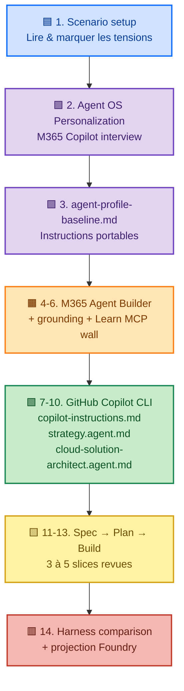

# 🧭 Plan d'exécution — Fred — AMA Lab (Agent OS)

> Lab : **AI-Assisted Estimation and Compliance in Regulated Design Work** (≈ 180 min)
> Objectif : passer d'une ambition IA floue à un travail d'**agent-system** contrôlé, revu, traçable.
> Boussole : `prompt → context → harness → agent → system boundary` et `agent = model + harness`.

---

## 🚦 Par quoi commencer ? (TL;DR)

1. **Lis** [`class/README.md`](../class/README.md) puis [`class/prerequisites.md`](../class/prerequisites.md).
2. **Vérifie l'accès** à M365 Copilot (Agent Builder) **ET** GitHub Copilot CLI (tu y es déjà ✅).
3. **Garde [`class/worksheets.md`](../class/worksheets.md) ouvert** : c'est ton workbook principal pendant tout le lab.
4. **Ne cherche pas à résoudre le scénario client** — l'objectif est d'observer comment chaque *harness* contraint ce que l'agent peut voir / faire / mémoriser / appeler.
5. **Conserve les preuves** (notes, fichiers `.md` locaux) à chaque étape : elles alimentent la comparaison finale Spec → Plan → Build.

---

## 🗺️ Parcours en un coup d'œil

**Légende couleurs**
| Couleur | Phase | Ce que je dois en retirer |
|---|---|---|
| 🟦 Bleu | Cadrage scénario | Risques, autorité humaine, besoins de preuves |
| 🟪 Violet | Personnalisation Agent OS | Mes red-lines, mon style, mes tradeoffs |
| 🟧 Orange | Harness *low-control* (M365) | Ce qui passe bien en instructions/grounding, **où ça bute** (mur Learn MCP) |
| 🟩 Vert | Harness *high-control* (Copilot CLI) | Contexte durable, agents par rôle, outils explicites |
| 🟨 Jaune | Spec → Plan → Build | Intent gouvernable, décisions revues, slices concrètes |
| 🟥 Rouge | Comparaison + Foundry | Tradeoffs d'architecture, frontières d'autorité humaine |

---

## ✅ Checklist d'exécution (mes étapes)

- [ ] **Setup** — lecture `class/README.md` + `prerequisites.md` + skim `references.md`
- [ ] **Étape 1** — lire `scenario-handout.md`, noter 3 tensions / 3 questions d'autorité humaine
- [ ] **Étape 2-3** — interview M365 Copilot → produire `agent-profile-baseline.md` (local)
- [ ] **Étape 4-6** — appliquer la baseline dans M365 Agent Builder, observer le grounding et **le mur Learn MCP**
- [ ] **Étape 7** — créer `$HOME\.copilot\copilot-instructions.md` à partir de la baseline
- [ ] **Étape 8** — créer `$HOME\.copilot\agents\strategy.agent.md`
- [ ] **Étape 9** — créer `$HOME\.copilot\agents\cloud-solution-architect.agent.md` avec Learn MCP
- [ ] **Étape 10** — `/restart` puis `/env` pour vérifier l'état de l'environnement
- [ ] **Étape 11** — rédiger la **Spec** (objectif, users, contraintes, hypothèses, succès, out-of-scope)
- [ ] **Étape 12** — rédiger le **Plan** (approche, risques, validation, frontières, triggers de revue)
- [ ] **Étape 13** — produire **3 à 5 build slices** revues
- [ ] **Étape 14** — comparer les harnesses et projeter sur Foundry

---

## 🎯 Outputs attendus à la fin

À la fin du lab, je dois pouvoir expliquer :

- pourquoi un **prompt seul ne suffit pas** en design réglementé ;
- comment `prompt → context → harness → agent → system boundary` aide à diagnostiquer la qualité d'un agent-system ;
- pourquoi **`agent = model + harness`** ;
- la différence entre un harness *low-control* et *high-control* ;
- à quoi ressemble une **première slice Spec → Plan → Build** responsable ;
- ce qui doit **rester décidé par un humain** quand l'IA assiste du design réglementé.

---

## ⚠️ Règles que je me fixe

- **Pas de troubleshooting > 10 min** sur un outil ; je passe en mode observation/pair (cf. `troubleshooting.md`).
- Je **préserve l'ordre du lab** : la comparaison finale dépend des preuves accumulées étape par étape.
- Je ne cherche **pas** à livrer le système client — je livre des **preuves d'architecture** et de l'autorité humaine.
- Mes fichiers personnels (`agent-profile-baseline.md`, `~/.copilot/...`) restent **hors du repo** : ce sont des artefacts de mon environnement, pas des livrables.

---

## 📎 Liens rapides

- Workbook : [`class/worksheets.md`](../class/worksheets.md)
- Scénario : [`class/scenario-handout.md`](../class/scenario-handout.md)
- Prompts copy/paste : [`class/prompts/`](../class/prompts/)
- Modèle mental & vocabulaire : [`class/references.md`](../class/references.md)
- Fallback : [`class/troubleshooting.md`](../class/troubleshooting.md)
- Vue facilitator (curiosité) : [`facilitator/run-of-show.md`](../facilitator/run-of-show.md)
