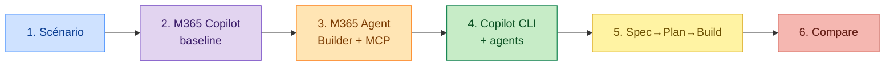

# 🧭 Plan Fred — AMA Lab



## À faire dans l'ordre

1. **Lire** [`class/scenario-handout.md`](../class/scenario-handout.md). Noter 3 tensions, ne pas résoudre.
2. **M365 Copilot** : interview de personnalisation → sauver `agent-profile-baseline.md` (local).
3. **M365 Agent Builder** : coller la baseline, tester grounding, observer le mur **Learn MCP**.
4. **GitHub Copilot CLI** — voir [§ Étape 4 ci-dessous](#étape-4--github-copilot-cli-détaillée).
5. **Spec → Plan → Build** : 1 spec, 1 plan, 3-5 slices.
6. **Comparer** les harnesses, projeter sur Foundry.

## Règles

- Workbook ouvert : [`class/worksheets.md`](../class/worksheets.md).
- Bloqué > 10 min sur un outil → observation/pair.
- Ne pas réordonner les étapes.

---

## Étape 4 — GitHub Copilot CLI (détaillée)

> Hors-repo, fichiers personnels sous `~/.copilot/`. **Ne pas committer.**

### Fichiers draftés

| Fichier | Rôle | Source du prompt |
|---|---|---|
| `~/.copilot/copilot-instructions.md` | Règles partagées (posture, risque, réponse, ambiguïté, challenge, évidence) — **role-agnostic** | [`class/prompts/create-copilot-instructions.md`](../class/prompts/create-copilot-instructions.md) |
| `~/.copilot/agents/strategy.agent.md` | Reasoning style + tradeoff posture + challenge — **strategy only** | [`class/prompts/create-strategy-agent.md`](../class/prompts/create-strategy-agent.md) |
| `~/.copilot/agents/cloud-solution-architect.agent.md` | Architect lens + Learn MCP `https://learn.microsoft.com/api/mcp` | [`class/prompts/create-cloud-solution-architect-agent.md`](../class/prompts/create-cloud-solution-architect-agent.md) |

Source utilisée pour drafter les 3 fichiers : [`Fred/agent-profile-baseline.md`](agent-profile-baseline.md).

### Tests de validation

1. Dans la session CLI, taper :
   ```text
   /restart
   /env
   ```
2. Vérifier dans la sortie de `/env` :
   - [ ] `copilot-instructions.md` est listé / chargé
   - [ ] Agents `strategy` et `cloud-solution-architect` listés
   - [ ] MCP server `microsoft-learn` attaché au CSA
3. Test fonctionnel **Strategy** :
   ```text
   /agent strategy
   "Should we standardize on a cloud-agnostic abstraction layer for our new platform?"
   ```
   Attendu : challenge la prémisse, demande exit cost / portability plan, ne plonge pas dans la techno.
4. Test fonctionnel **CSA + Learn MCP** :
   ```text
   /agent cloud-solution-architect
   "What are the current Azure OpenAI deployment options for a regulated workload in EU?"
   ```
   Attendu : la réponse cite des URLs `learn.microsoft.com` (preuve que le MCP est utilisé).

### Layering check (Étape D)

Après les 3 fichiers, valider qui hérite quoi :

| Guidance | Shared | Strategy | CSA |
|---|:---:|:---:|:---:|
| Posture générale (risque / réversibilité / évidence) | ✅ | | |
| Decision framing, tradeoff posture | | ✅ | |
| Microsoft portfolio depth + Learn MCP | | | ✅ |
| Escalation rules (générales) | ✅ | | |
| Communication fingerprint (générique) | ✅ | | |
| Response shape technique (feasibility/risk/scale) | | | ✅ |

### Règles
- Lire et corriger les 3 fichiers — l'IA peut dupliquer ; trancher manuellement.
- Pas d'orchestration : 2 agents existent, ils ne se passent **pas** la main automatiquement.
- Ne **pas** committer `~/.copilot/...` dans le repo.
