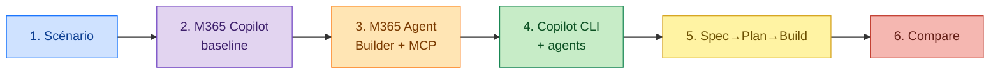

# 🧭 Plan Fred — AMA Lab



## À faire dans l'ordre

1. **Lire** [`class/scenario-handout.md`](../class/scenario-handout.md). Noter 3 tensions, ne pas résoudre.
2. **M365 Copilot** : interview de personnalisation → sauver `agent-profile-baseline.md` (local).
3. **M365 Agent Builder** : coller la baseline, tester grounding, observer le mur **Learn MCP**.
4. **GitHub Copilot CLI** — voir [§ Étape 4 ci-dessous](#étape-4--github-copilot-cli-détaillée).
5. **Spec → Plan → Build** : 1 spec, 1 plan, 3-5 slices. Voir [§ Étape 5 ci-dessous](#étape-5--spec--plan--build-détaillée).
6. **Comparer** les harnesses, projeter sur Foundry.

## Règles

- Workbook ouvert : [`class/worksheets.md`](../class/worksheets.md).
- Bloqué > 10 min sur un outil → observation/pair.
- Ne pas réordonner les étapes.

---

## Étape 4 — GitHub Copilot CLI (détaillée)

> Hors-repo, fichiers personnels sous `~/.copilot/`. **Ne pas committer.**

### Fichiers draftés

| Fichier | Rôle | Source du prompt |
|---|---|---|
| `~/.copilot/copilot-instructions.md` | Règles partagées (posture, risque, réponse, ambiguïté, challenge, évidence) — **role-agnostic** | [`class/prompts/create-copilot-instructions.md`](../class/prompts/create-copilot-instructions.md) |
| `~/.copilot/agents/strategy.agent.md` | Reasoning style + tradeoff posture + challenge — **strategy only** | [`class/prompts/create-strategy-agent.md`](../class/prompts/create-strategy-agent.md) |
| `~/.copilot/agents/cloud-solution-architect.agent.md` | Architect lens + Learn MCP `https://learn.microsoft.com/api/mcp` | [`class/prompts/create-cloud-solution-architect-agent.md`](../class/prompts/create-cloud-solution-architect-agent.md) |

Source utilisée pour drafter les 3 fichiers : [`Fred/agent-profile-baseline.md`](agent-profile-baseline.md).

### Tests de validation

1. Dans la session CLI, taper :
   ```text
   /restart
   /env
   ```
2. Vérifier dans la sortie de `/env` :
   - [ ] `copilot-instructions.md` est listé / chargé
   - [ ] Agents `strategy` et `cloud-solution-architect` listés
   - [ ] MCP server `microsoft-learn` attaché au CSA
3. Test fonctionnel **Strategy** :
   ```text
   /agent strategy
   "Should we standardize on a cloud-agnostic abstraction layer for our new platform?"
   ```
   Attendu : challenge la prémisse, demande exit cost / portability plan, ne plonge pas dans la techno.
4. Test fonctionnel **CSA + Learn MCP** :
   ```text
   /agent cloud-solution-architect
   "What are the current Azure OpenAI deployment options for a regulated workload in EU?"
   ```
   Attendu : la réponse cite des URLs `learn.microsoft.com` (preuve que le MCP est utilisé).

### Layering check (Étape D)

Après les 3 fichiers, valider qui hérite quoi :

| Guidance | Shared | Strategy | CSA |
|---|:---:|:---:|:---:|
| Posture générale (risque / réversibilité / évidence) | ✅ | | |
| Decision framing, tradeoff posture | | ✅ | |
| Microsoft portfolio depth + Learn MCP | | | ✅ |
| Escalation rules (générales) | ✅ | | |
| Communication fingerprint (générique) | ✅ | | |
| Response shape technique (feasibility/risk/scale) | | | ✅ |

### Règles
- Lire et corriger les 3 fichiers — l'IA peut dupliquer ; trancher manuellement.
- Pas d'orchestration : 2 agents existent, ils ne se passent **pas** la main automatiquement.
- Ne **pas** committer `~/.copilot/...` dans le repo.

---

## Étape 5 — Spec → Plan → Build (détaillée)

> Source : [`class/worksheets.md`](../class/worksheets.md) §6.
> Inputs : tensions du scénario, baseline, observations Agent Builder, agents Strategy + CSA.
> But : **séparer intent / approche / slices revues** — pas produire la solution finale.

### Step A — Anchor (cadrage avant les prompts)
Répondre aux 3 questions à toi-même :

| Question | Ta réponse |
|---|---|
| Quel est le 1ᵉʳ slice que **tu choisis** d'attaquer dans le scénario ? | _ex: Generate first-pass cost estimate from a structured plan_ |
| Quel concern est le plus à risque (context / harness / responsibility / orchestration / evaluation / system boundary) ? | _ex: evaluation + system boundary_ |
| Quel work product visible rendrait l'amélioration inspectable ? | _ex: side-by-side diff estimate IA vs estimate expert_ |

### Step B — Spec slice (avec l'agent Strategy)
Dans CLI : `/agent strategy` puis :
```text
As the Strategy agent, use the customer scenario, baseline instructions, and lab observations to draft a concise specification slice.
Do not solve the scenario yet.
Separate the specification concerns from the solution.
Use these categories: objective, primary users, user value, constraints, assumptions, success criteria, and out-of-scope boundaries.
Write the result as Markdown.
```
Sauver dans `Fred/spec-slice.md`.

### Step C — Plan slice (avec l'agent Strategy)
```text
As the Strategy agent, use the specification slice to draft a concise planning slice.
Do not create the final architecture brief.
Name the recommended approach, durable context needed, harness or control-surface assumptions, tradeoffs, validation method, and revisit trigger.
Make clear which decisions must be made before build/task execution.
Write the result as Markdown.
```
Sauver dans `Fred/plan-slice.md`.

### Step D — Build slices (avec l'agent CSA)
Dans CLI : `/agent cloud-solution-architect` puis :
```text
As the CSA agent, use the specification slice and planning slice to propose 3-5 reviewable build/task slices.
Each slice should produce a reviewable artifact or decision output, name its dependency, and state what review evidence would prove it is useful.
Make clear how each slice surfaces architecture and risk concerns so reviewers can inspect context, tools, permissions, memory, evaluation, and human authority before any final solution is implemented.
Do not include app code, setup work, CI, or a final polished recommendation.
Keep the slices architecture- and risk-reviewable.
Write the result as Markdown.
```
Sauver dans `Fred/build-slices.md`.

### Tableau attendu pour les slices
| Build / task slice | Artifact ou decision output | Depends on | Review evidence |
|---|---|---|---|
| | | | |

### "Good enough" means
- 1 objectif **étroit** (pas la résolution du scénario complet)
- contraintes **explicites** + assumptions tracées
- approche + méthode de **validation** + revisit trigger
- **3 à 5 slices** revues, chacune avec un artefact inspectable et son evidence

### Pièges à éviter
- Sauter directement à la solution finale → tu perds la valeur du Spec/Plan
- Empiler 10 slices techniques → l'objectif est **revue d'architecture**, pas exécution
- Inclure du code applicatif, CI, setup → hors scope ici
- Laisser l'autorité humaine implicite — chaque slice doit dire **où l'humain décide**

### One-liner à retenir
> Strategy frame l'intent et les tradeoffs ; CSA verifie les risques d'architecture et propose des slices revues ; les humains gardent les décisions accountable.

---

## Étape 6 — Harness comparison + Foundry projection (détaillée)

> Source : [`class/worksheets.md`](../class/worksheets.md) §7.
> Inputs : observations Steps 3 (Agent Builder) + 4 (Copilot CLI) + 5 (Spec/Plan/Build).
> But : nommer **2 tradeoffs d'architecture** (pas de feature compare, pas de préférence d'UI) et projeter sur Foundry.

### Step A — Comparer les 6 layers
Remplir le tableau dans `Fred/harness-comparison.md` (déjà ébauché). 6 lignes : model+runtime, tools, context, permissions, memory, orchestration. Pour chaque, dire **ce que la surface rend explicite vs. implicite** — pas la liste des features.

### Step B — Synthèse (4 questions)
1. Qu'est-ce que **M365 Copilot Studio** rend plus facile ?
2. Qu'est-ce que **Copilot CLI** rend plus facile ?
3. Projection **Foundry** :
   - Quels layers tiennent toujours ?
   - Comment certains se ré-implémentent ?
4. Quelle limite compte le plus pour le **first responsible slice** (cf. Step D du Spec/Plan/Build) ?

### Closing reflection
> Si on réussit, qu'est-ce que le système rend plus facile pour les humains, et qu'est-ce qu'il ne doit jamais décider à leur place ?

### "Good enough" means
- 2 tradeoffs d'architecture nommés (pas product preference)
- ≥1 tradeoff parle de tool/MCP, context durability, role separation, review evidence, human handoff, ou ré-implémentation Foundry
- Projection Foundry citée Learn

### Pièges à éviter
- Comparer le nombre de features → invalide
- Préférence d'interface → invalide
- Foundry = "Studio mais en mieux" → faux ; c'est un harness différent (Agent Service, Tool Catalog, Connected Agents)

### One-liner à retenir
> Low-code vs pro-code n'est **pas** la vraie distinction. Ce qui compte : qui contrôle context, tools, memory, permissions, reviewability — et où les humains gardent l'autorité.
