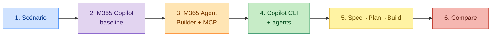

# 🧭 Plan Fred — AMA Lab

## À faire dans l'ordre

1. **Lire** [`class/scenario-handout.md`](../class/scenario-handout.md). Noter 3 tensions, ne pas résoudre.
2. **M365 Copilot** : interview de personnalisation → sauver `agent-profile-baseline.md` (local).
3. **M365 Agent Builder** : coller la baseline, tester grounding, observer le mur **Learn MCP**.
4. **GitHub Copilot CLI** :
   - `~/.copilot/copilot-instructions.md` (baseline)
   - `~/.copilot/agents/strategy.agent.md`
   - `~/.copilot/agents/cloud-solution-architect.agent.md` (avec Learn MCP)
   - `/restart` puis `/env` pour vérifier.
5. **Spec → Plan → Build** : 1 spec, 1 plan, 3-5 slices.
6. **Comparer** les harnesses, projeter sur Foundry.

## Règles

- Workbook ouvert : [`class/worksheets.md`](../class/worksheets.md).
- Bloqué > 10 min sur un outil → observation/pair.
- Ne pas réordonner les étapes.
